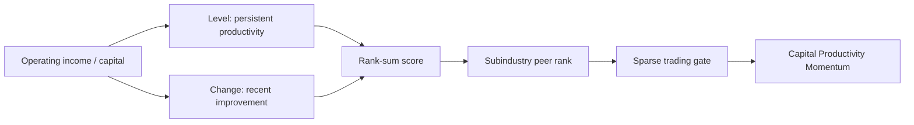

# Capital Productivity Momentum Alpha Proposal

> [!abstract] Research Thesis
> **Capital Productivity Momentum** is a fundamental equity alpha that selects firms with both high and improving operating income relative to capital. The thesis is that improving capital productivity reflects better operating efficiency, capital discipline, or business quality, and that this information may be incorporated into prices slowly because accounting-based quality changes are low-frequency and noisy.

## Snapshot

| Dimension | Description |
| --- | --- |
| Signal family | Profitability / quality |
| Core variable | `operating_income / cap` |
| Economic idea | Capital productivity improvement |
| Cross-sectional control | `subindustry` peer ranking |
| Trading style | Medium-horizon fundamental signal |
| Research status | Submitted candidate; OS checks pending |
| Main risk | Crowded profitability exposure or accounting-data leakage |

## Formula

> [!quote] Fast Expression
> ```text
> x = winsorize(ts_backfill(operating_income/cap, 120), std=4);
> lvl = ts_mean(x, 60);
> chg = ts_delta(ts_mean(x, 20), 60);
> y = rank(lvl) + rank(chg);
> trade_when(rank(y) > 0.72, group_rank(y, subindustry), -1)
> ```

## Signal Map

| Step | Component | Purpose |
| --- | --- | --- |
| 1 | `operating_income / cap` | Measures operating earnings generated per unit of capital. |
| 2 | `ts_backfill(..., 120)` | Makes low-frequency fundamental data usable in daily simulation. |
| 3 | `winsorize(..., std=4)` | Reduces extreme accounting outliers. |
| 4 | `ts_mean(x, 60)` | Captures persistent capital productivity. |
| 5 | `ts_delta(ts_mean(x, 20), 60)` | Captures recent improvement in productivity. |
| 6 | `rank(lvl) + rank(chg)` | Rewards firms with both quality level and quality improvement. |
| 7 | `group_rank(y, subindustry)` | Compares each firm with economically similar peers. |
| 8 | `trade_when(rank(y) > 0.72, ...)` | Trades only when the combined signal is sufficiently strong. |



## Economic Rationale

> [!info] Why this should make sense
> The alpha is not a price-pattern signal. It is a quality-improvement signal. Firms that generate more operating income from the same capital base may have stronger asset utilization, cost discipline, pricing power, or capital allocation quality. If that productivity is improving, the firm may be undergoing an operational upgrade that is not fully priced yet.

Capital Productivity Momentum belongs to the profitability-quality literature. Novy-Marx's gross profitability evidence suggests that profitable firms can earn higher average returns even when they look expensive on traditional value metrics. Fama and French's five-factor model later treats profitability as a major cross-sectional return dimension.

This expression adapts that academic prior in a more operational way. It does not simply buy high profitability. It asks for:

- a high level of operating profitability relative to capital;
- recent improvement in that same ratio;
- comparison against subindustry peers rather than the whole market;
- a sparse gate that avoids weak observations.

## Empirical Record

| Metric | Recorded value |
| --- | ---: |
| Status | `ACTIVE` |
| Stage | `OS` |
| Grade | `AVERAGE` |
| Submission timestamp | `2026-06-21T00:06:02-04:00` |
| In-sample Sharpe | `1.71` |
| In-sample Fitness | `1.14` |
| Turnover | `3.36%` |
| Returns | `5.55%` |
| Drawdown | `2.32%` |
| Self-correlation | `0.5956` |
| Sub-universe Sharpe | `1.43` vs `0.74` cutoff |
| Train Sharpe | `1.84` |
| Test Sharpe | `1.34` |

> [!warning] Interpretation
> The empirical record is supportive but not conclusive. Test Sharpe is lower than train Sharpe, and OS checks remain pending in the local export. The alpha should be treated as a submitted research candidate requiring ongoing validation, not as proof of future returns.

## Why The Construction Is Plausible

| Design choice | Rationale |
| --- | --- |
| Use operating income over capital | Links profitability to the capital base required to generate it. |
| Add level and change | Avoids relying only on stale static quality. |
| Use rank-sum instead of product | Preserves breadth and avoids over-penalizing moderate support from one leg. |
| Rank within subindustry | Reduces sector and business-model bias. |
| Gate on stronger scores | Avoids weak, noisy observations and improves signal concentration. |

## Validation Plan

> [!todo] Required checks before template promotion
> - Confirm that `operating_income` and `cap` are point-in-time fields.
> - Test nearby activation thresholds: `0.68`, `0.72`, `0.76`.
> - Test nearby level and change windows.
> - Compare `subindustry`, `industry`, and no peer ranking.
> - Measure exposure to profitability, value, size, investment, momentum, and low-volatility factors.
> - Recheck self-correlation against the current submitted pool.
> - Review OS results once available.

## Failure Criteria

> [!failure] Demote or reject if
> - performance depends on one exact threshold or one short period;
> - returns are concentrated in one sector or market regime;
> - live self-correlation rises above the platform threshold;
> - OS performance fails;
> - point-in-time review suggests restatement leakage;
> - the alpha behaves like a generic crowded profitability factor rather than a distinct signal.

## Decision

> [!success] Current decision
> Keep **Capital Productivity Momentum** as a submitted profitability-quality proposal. Its value is not only the recorded Sharpe; it is the clean economic chain from capital productivity to profitability quality, improvement, peer-relative ranking, and sparse activation.

The next research step is to build a small set of sibling alphas that preserve the same mechanism while testing alternative denominators, peer groups, and improvement windows.

## Sources

- Local submitted-alpha export: `/Users/nuthdanai/Desktop/02_Quant_Investment/WorldQuant_Brain_AI_Alpha_Collection_2026-06-23/01_active_workspaces/Alpha_LLM_Research/generated/brain_alpha_exports/submitted_alpha_details.json`
- Local project memory: [[01 Projects/Quant/worldquant-brain/_PROJECT]]
- Validation context: [[05 Knowledge/LLM-Wiki/pages/alpha-validation-guardrails]]
- Robert Novy-Marx, "The Other Side of Value: Good Growth and the Gross Profitability Premium": [SSRN](https://papers.ssrn.com/sol3/papers.cfm?abstract_id=1598056)
- Eugene F. Fama and Kenneth R. French, "A Five-Factor Asset Pricing Model": [SSRN](https://papers.ssrn.com/sol3/papers.cfm?abstract_id=2287202)
