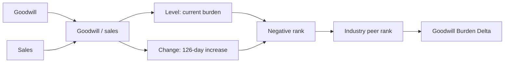

# Goodwill Burden Delta Alpha Proposal

> [!abstract] Research Thesis
> **Goodwill Burden Delta** is a paper-derived fundamental equity alpha that penalizes firms with both high and recently increasing goodwill relative to sales. The financial thesis is that goodwill created through acquisitions can embed overpayment, hard-to-value intangible assets, and future impairment risk. If investors underreact to this accounting burden, firms with large and worsening goodwill intensity should underperform cleaner peers within the same industry.

## Snapshot

| Dimension | Description |
| --- | --- |
| Alpha ID | `Wjpb7KAj` |
| Signal family | Accounting quality / acquisition discipline |
| Source prior | RP09, "The Invisible Burden: Goodwill and Asset Prices" |
| Core variable | `goodwill / sales` |
| Economic idea | Acquisition-related goodwill burden and impairment risk |
| Cross-sectional control | `industry` peer ranking |
| Trading style | Low-turnover fundamental signal |
| Research status | User-reported submitted on 2026-06-27; self-correlation pending |
| Main risk | Restatement lag, sparse goodwill coverage, or generic quality/value exposure |

## Formula

> [!quote] Fast Expression
> ```text
> group_rank(
>   -rank(winsorize(ts_backfill(goodwill, 252) / ts_backfill(sales, 252), std=4))
>   - rank(ts_delta(winsorize(ts_backfill(goodwill, 252) / ts_backfill(sales, 252), std=4), 126)),
>   industry
> )
> ```

## Signal Map

| Step | Component | Purpose |
| --- | --- | --- |
| 1 | `goodwill / sales` | Scales goodwill by firm operating activity rather than raw balance-sheet size. |
| 2 | `ts_backfill(..., 252)` | Makes low-frequency accounting fields available in daily simulation while preserving a slow fundamental horizon. |
| 3 | `winsorize(..., std=4)` | Limits extreme accounting ratios from dominating the cross-section. |
| 4 | `-rank(goodwill / sales)` | Rewards lower goodwill burden and penalizes high acquisition-related intangible load. |
| 5 | `-rank(ts_delta(..., 126))` | Penalizes firms whose goodwill burden has increased over roughly half a trading year. |
| 6 | `group_rank(..., industry)` | Compares firms against industry peers with similar acquisition intensity and accounting structure. |



## Economic Rationale

> [!info] Why this should make sense
> Goodwill is not ordinary working capital or productive fixed capital. It usually appears when an acquirer pays more than the identifiable net assets of a target. A high goodwill-to-sales ratio can therefore reflect aggressive acquisition pricing, weak post-merger economic productivity, or balance-sheet assets whose value may later be impaired.

The source paper argues that goodwill-to-sales negatively predicts U.S. stock returns and interprets the pattern as market underreaction to difficult-to-value goodwill information. This alpha translates that prior into a WorldQuant BRAIN expression by shorting high goodwill burden and favoring cleaner balance sheets inside each industry.

The dynamic leg is important. A pure goodwill level signal was too static in earlier repair attempts. Adding the 126-day change term asks a sharper question: is the firm's acquisition-related burden not only high, but also worsening? This makes the signal closer to an accounting deterioration factor than a slow, stale balance-sheet ratio.

## Empirical Record

| Metric | Recorded value |
| --- | ---: |
| Alpha ID | `Wjpb7KAj` |
| Expression key | `rp09_gw_focus_018_level_delta126` |
| Brain grade | `AVERAGE` |
| Source artifact status | `hard_checks_pass_self_corr_pending` |
| User-reported submission date | `2026-06-27` |
| Region / universe | `USA / TOP3000` |
| Delay / decay | `1 / 6` |
| Neutralization | `INDUSTRY` |
| Truncation | `0.08` |
| In-sample Sharpe | `1.59` |
| In-sample Fitness | `1.11` |
| Turnover | `2.76%` |
| Returns | `6.14%` |
| Drawdown | `4.04%` |
| Margin | `0.004444` |
| Long count | `1548` |
| Short count | `1561` |
| Sub-universe Sharpe | `0.92` vs `0.69` cutoff |
| Self-correlation | `PENDING` |

## Train / Test Record

| Slice | Sharpe | Fitness | Returns | Turnover | Drawdown | Margin |
| --- | ---: | ---: | ---: | ---: | ---: | ---: |
| IS | `1.59` | `1.11` | `0.0614` | `0.0276` | `0.0404` | `0.004444` |
| Train | `1.59` | `1.15` | `0.0657` | `0.0286` | `0.0404` | `0.004594` |
| Test | `1.51` | `0.94` | `0.0489` | `0.0255` | `0.0197` | `0.003842` |

> [!warning] Interpretation
> The empirical record is supportive but incomplete. Hard checks passed, including sub-universe Sharpe, but the source artifact still records self-correlation as pending. Treat this as a submitted research candidate, not a validated production signal.

## Why The Construction Is Plausible

| Design choice | Rationale |
| --- | --- |
| Use `goodwill / sales` | Connects goodwill to operating scale and avoids simply ranking large acquirers by raw goodwill. |
| Penalize both level and change | Separates persistently high goodwill burden from newly worsening accounting burden. |
| Use a 126-day delta | Captures medium-horizon accounting deterioration without relying only on annual revisions. |
| Winsorize the ratio | Reduces denominator and accounting outlier risk. |
| Rank within industry | Controls for structurally different M&A intensity, margins, and intangible accounting practices. |
| Keep turnover low | Fits a slow fundamental accounting signal rather than a short-horizon price signal. |

## Validation Plan

> [!todo] Required checks before template promotion
> - Fetch final self-correlation and IQC gate results for `Wjpb7KAj`.
> - Confirm point-in-time handling for `goodwill` and `sales`, including reporting lag and restatement behavior.
> - Compare level-only, delta-only, 126-day delta, 252-day delta, and 504-day delta variants.
> - Review sector and industry concentration, especially acquisitive technology, healthcare, and industrial firms.
> - Test denominator robustness against low-sales firms and negative or near-zero sales observations.
> - Measure exposure to value, profitability, investment, size, leverage, and generic accounting-quality factors.
> - Re-run after adding the current submitted-alpha pool to check whether this remains orthogonal to turnover-state alphas.

## Failure Criteria

> [!failure] Demote or reject if
> - self-correlation fails against the live submitted pool;
> - performance is mostly a sector or mega-cap acquisition-cycle bet;
> - the signal disappears when low-sales denominator outliers are constrained;
> - returns come primarily from stale accounting restatements or reporting-lag artifacts;
> - the alpha behaves like a generic value or quality factor rather than a distinct goodwill-burden signal;
> - out-of-sample fitness remains below threshold after self-correlation and IQC review.

## Decision

> [!success] Current decision
> Keep **Goodwill Burden Delta** as the preferred goodwill proposal for the submitted/pending set. It has a clear academic prior, a clean accounting mechanism, low turnover, and hard-check support. The next decision depends on self-correlation and IQC review.

This alpha should not be mixed with many unrelated fields. Its research value is the clean mechanism: high and worsening goodwill burden may reveal acquisition overpayment or intangible-asset impairment risk that investors price too slowly.

## Sources

- Local paper card: `/Users/nuthdanai/Desktop/02_Quant_Investment/WorldQuant_Brain_AI_Alpha_Collection_2026-06-23/07_research_papers/worldquant_brain_research_papers_for_users_20260626/knowledge/cards/rp09-the-invisible-burden-goodwill.md`
- Local simulation result note: `/Users/nuthdanai/Desktop/02_Quant_Investment/WorldQuant_Brain_AI_Alpha_Collection_2026-06-23/07_research_papers/worldquant_brain_research_papers_for_users_20260626/generated_alpha_candidates/rp09_goodwill_focus_repair_result_20260626.md`
- Local passed-alpha proposal export: `/Users/nuthdanai/Desktop/02_Quant_Investment/WorldQuant_Brain_AI_Alpha_Collection_2026-06-23/06_alpha_catalog/alpha_proposals/alpha_proposal_passed_alphas_20260627.md`
- Local project memory: [[01 Projects/Quant/worldquant-brain/_PROJECT]]
- Paper source: Xin Liu, Chengxi Yin, and Weinan Zheng, "The Invisible Burden: Goodwill and Asset Prices": [SSRN](https://ssrn.com/abstract=3292675)
